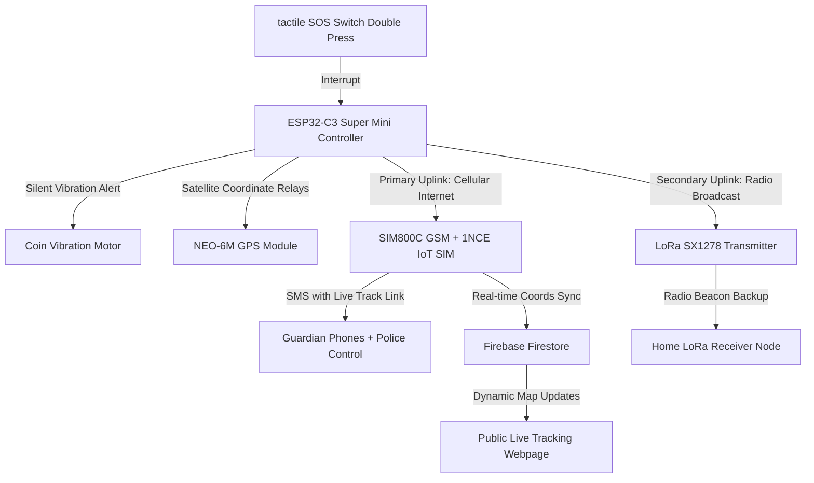

# Suraksha — Smart Women's Safety Companion

Suraksha is a comprehensive, low-cost women's safety ecosystem combining customized IoT hardware and a real-time responsive web application to protect women in emergency situations.

---

## 1. Abstract

When a user is in danger, she double-presses a hidden button on her compact Suraksha keychain device. Instantly, an emergency SOS alert is dispatched. The hardware companion transmits an emergency SMS including a custom live location tracking link to all configured emergency guardians and the police.

Guardians click the link to launch a fully public, real-time live tracking dashboard—functioning on any phone browser without requiring login or application installations. The page displays her coordinate transitions smoothly on an interactive map, calculating movement states and drawing dotted trail lines representing historical telemetry relays.



---

## 2. Problem Statement

Existing women's safety solutions in India exhibit critical architectural limitations:
* **Smartphone Constraints**: Panic apps require unlocking the screen—which is impossible or highly conspicuous in immediate danger.
* **Network Reliability**: Standard panic buttons depend on a single mobile operator. If network coverage drops, the SOS broadcast fails.
* **Battery Drain**: Continuous GPS background apps exhaust smartphone batteries quickly.
* **Price Barriers**: Safe smartwatches or premium safety trackers are expensive (varying from ₹5,000 to ₹50,000+).
* **Daily SMS Caps**: Traditional SMS triggers often hit daily local operator limits (typically capped at 100 SMS/day).

**Suraksha** resolves these critical limitations in a unified, low-power hardware and software configuration costing under ₹2,500.

---

## 3. Objectives

1. **Compact Shell**: Build a lightweight, miniature safety tracker that clips onto keychains or bags.
2. **eSIM Signal Resilience**: Leverage a multi-network 1NCE IoT SIM that automatically swaps operators to find the strongest LTE tower.
3. **Offline Backup Relay**: Integrate a LoRa radio transmitter capable of sending emergency panic beacons directly to a home station without relying on cellular networks.
4. **Instant SOS Trigger**: Double-pressing a single physical button fires the alert—completely bypassing cellular screens.
5. **Dynamic Web Map**: Host a responsive public live tracking route (`/track/:userId`) updated in real-time.
6. **Relative Tickers & Speed Deltas**: Display speed states ("Moving 🚶" vs "Stationary ⚠️") and telemetry update delays.
7. **Two-Way Coordinate Relays**: Allow guardians to overlay their own live location pins on the same map to coordinate dispatch.
8. **Ultra-Low Cost**: Keep total hardware assembly costs under ₹2,500.

---

## 4. System Architecture

```
                   +-----------------------------------+
                   |          SATELLITE GPS            |
                   +-----------------+-----------------+
                                     |
                                     v GPS Coordinates
  +----------------------------------+----------------------------------+
  |                                                                     |
  |   +-------------------+  GPS Serial Link  +---------------------+   |
  |   |    NEO-6M GPS     |==================>|  ESP32-C3 Super     |   |
  |   +-------------------+                   |     Mini Core       |   |
  |                                           +---------+-----------+   |
  |   +-------------------+    Cellular Link            |               |
  |   |    SIM800C GSM    |<============================+               |
  |   +---------+---------+                             | Serial        |
  |             |                                       | Broadcast     |
  |             v IoT SIM Internet                      v               |
  |   +---------+---------+                   +---------+-----------+   |
  |   |   1NCE IoT SIM    |                   |    LoRa SX1278      |   |
  |   +-------------------+                   +---------+-----------+   |
  |                                                     |               |
  |                          SURAKSHA DEVICE ENCLOSURE   | Radio RF      |
  +-----------------------------------------------------|---------------+
                                                        |
                                                        v
                                              +---------+-----------+
                                              | Home LoRa Receiver  |
                                              +---------------------+
```

### 4.1 Hardware Layer

| Subsystem | Component | Specifications & Details |
| :--- | :--- | :--- |
| **Microcontroller** | ESP32-C3 Super Mini | RISC-V 32-bit single-core processor (160MHz). Built-in Wi-Fi & Bluetooth 5 (LE) for seamless eSIM companion sync. |
| **Location System** | NEO-6M GPS Module | Receives coordinate data directly from GPS satellites; requires no network or SIM. |
| **Primary Link** | SIM800C GSM + 1NCE SIM | Cellular modem firing custom SMS gateways and publishing HTTP requests. |
| **Secondary Link** | LoRa SX1278 Transceivers | Spreads a long-range 433MHz radio beacon directly to a home base receiver. |
| **Power** | 500mAh Li-Po + TP4056 | Flat thin cell with Micro-USB charging safety protection loop. |
| **Trigger Switch** | Micro Push Buttons | Compact tactile push buttons using ESP32-C3 internal pull-ups (no external resistors needed!). |
| **User Feedback** | Coin Vibration Motor | Silent vibration pulses (3 bursts) confirming SMS alerts successfully fired. |

### 4.2 Software Layer

* **Frontend**: React 19 + Vite compiling in **372ms** to Vercel.
* **Database**: Firebase Firestore storing emergency profile networks, configurations, and location states.
* **Onboarding Personalization**: Beautiful purple-pink full-screen wizard locking account access until Male/Female properties are defined.
* **Real-time GPS Sync**: Geolocation coordinates automatically write to Firestore subcollections if tracked users move.
* **Public Tracking Layout**: Sandboxed Leaflet maps rendering official Google Maps cartographic tile layers.

### 4.3 3-Layer Alert System

1. **Cellular Internet**: SIM800C posts satellite coordinates to Firestore, updating the family's tracking map in real-time.
2. **eSIM SMS Dispatch**: modems fire immediate localized emergency texts containing direct maps and live tracking URLs.
3. **LoRa RF RF Beacons**: In remote dead zones, LoRa RF chips dispatch high-frequency radio pings directly to a home station.

---

## 5. How It Works — Step by Step

### 5.1 Normal Mode (No SOS)
1. The hardware capsule is carried in a pocket or bag.
2. The ESP32-C3 Super Mini transitions into low-power deep sleep registers.
3. GPS and GSM components are shut down to conserve charge, yielding **48+ hours** of idle runtime.

### 5.2 SOS Triggered (Double Press)
1. In immediate threat, the user double-presses the micro tactile button within `500ms`.
2. Accidental single clicks are ignored.
3. ESP32-C3 wakes via GPIO interrupt, activating the NEO-6M GPS to lock satellite vectors.
4. The SIM800C cellular link formats and broadcasts the SOS SMS.
5. The LoRa transmitter broadcasts the radio alert packet.
6. The vibration motor pulses 3 times silently, giving the user haptic verification.
7. Coordinates sync to Firebase Firestore every **30 seconds**.
8. Guardians click the link to track her movement live on their browsers.

### 5.3 SMS Format

```
🚨 EMERGENCY! Jayasri needs help immediately!
📍 Current Location: https://maps.google.com/?q=16.284583,80.457524
🗺️ Track her LIVE: https://suraksha-raksha.vercel.app/track/userId123
Location updates every 30 seconds automatically.
— Suraksha Safety App
```

### 5.4 Live Tracking Page
* The public route requires **no logins** or app installations.
* Map markers dynamically select custom emoji avatars based on gender (👦/👧).
* Relative tickers display real-time update delays.
* The system computes speed states using successive GPS coordinate offsets.
* The map tracks a dashed trail of her route.
* Viewers can share their own live location pin (👨) to coordinate rescue.

---

## 6. Hardware Parts List & Cost Summary

### Main Electronics Components

| # | Component Name | Specifications | Qty | Unit Price | Source |
| :-: | :--- | :--- | :-: | :-: | :--- |
| 1 | ESP32-C3 Super Mini | RISC-V 160MHz processor, Wi-Fi/BLE, USB-C (HW-466AB) | 1 | ₹280 | Amazon / Robu.in |
| 2 | NEO-6M GPS | u-blox Core, 1-5m accuracy | 1 | ₹280 | Amazon / Robu.in |
| 3 | SIM800C GSM | Quad-band 850/900/1800/1900 | 1 | ₹280 | Amazon / Robu.in |
| 4 | LoRa SX1278 | Ra-01 433MHz module | 2 | ₹520 | Amazon / Robu.in |
| 5 | LiPo Battery | 3.7V 500mAh flat thin cell | 1 | ₹180 | Amazon / Robu.in |
| 6 | TP4056 Module | Micro-USB Li-Po charging | 1 | ₹40 | Amazon / Robu.in |
| 7 | Micro Push Buttons | Tactile mini breadboard buttons | 2 | ₹20 | Amazon / Robu.in |
| 8 | Coin Vibration Motor | 10mm diameter flat motor | 1 | ₹40 | Amazon / Robu.in |
| 9 | Jumper Wires | Male-to-Male connector pack | 1 | ₹50 | Amazon / Robu.in |
| 10 | Shoulderless Breadboard | Half-size compact breadboard | 1 | ₹60 | Amazon / Robu.in |
| 11 | 1NCE IoT SIM | Global multi-network roaming | 1 | ₹600 | 1nce.com / Amazon |

### Optional Components for Final Build

| # | Component Name | Specifications | Qty | Unit Price | Source |
| :-: | :--- | :--- | :-: | :-: | :--- |
| 12 | OLED Display | 0.96 inch I2C 128x64 pixels | 1 | ₹80 | Amazon |
| 13 | Project Box | 55x35x12mm plastic enclosure | 1 | ₹50 | Amazon / Local |
| 14 | Keychain Ring | Metal key loop and clip | 2 | ₹20 | Local Shop |
| 15 | Prototype PCB | 5x7cm double-sided board | 2 | ₹30 | Robu.in |
| 16 | USB-C Port | Panel mount micro USB connector | 1 | ₹20 | Amazon |

### Cost Summary

```
Main Electronics Components (Items 1-10) ....... ₹1,750
1NCE IoT SIM (Global, One-time cost) ............. ₹600
Optional Casing & PCB (Items 12-16) .............. ₹200
Miscellaneous (Extra wires, solder, spares) ...... ₹150
--------------------------------------------------------
TOTAL ESTIMATED COST ........................... ₹2,700
```
> [!NOTE]
> The ESP32-C3 Super Mini incorporates integrated Wi-Fi, Bluetooth, and standard USB-C programming, removing the need for external FTDI boards!

---

## 7. Wiring Connections

### 7.1 GPS Module (NEO-6M) to ESP32-C3 Super Mini

```
NEO-6M GPS Pin  ====>  ESP32-C3 Super Mini Pin
---------------------------------------------
VCC            =====>  3V3 (or 5V pin)
GND            =====>  GND
TX (Transmit)  =====>  GPIO20 (Hardware RX)
RX (Receive)   =====>  GPIO21 (Hardware TX)
```

### 7.2 GSM Module (SIM800C) to ESP32-C3 Super Mini

```
SIM800C GSM Pin  ====>  ESP32-C3 Super Mini Pin
----------------------------------------------
VCC             =====>  5V / External Power (Requires up to 2A burst current)
GND             =====>  GND (Must share common ground with ESP32!)
TX (Transmit)   =====>  GPIO6 (Software RX)
RX (Receive)    =====>  GPIO7 (Software TX)
```

### 7.3 Compact Breadboard Pin Interconnections

* **Primary SOS Switch (Micro Button 1)**:
  * Connection A -> ESP32-C3 **GPIO2** (Configured as `INPUT_PULLUP` in Arduino IDE)
  * Connection B -> ESP32-C3 **GND**
* **Secondary System Check/Reset (Micro Button 2)**:
  * Connection A -> ESP32-C3 **GPIO3** (Configured as `INPUT_PULLUP` in Arduino IDE)
  * Connection B -> ESP32-C3 **GND**
* **Coin Vibration Motor**:
  * Positive lead -> ESP32-C3 **GPIO5**
  * Negative lead -> **GND**
* **LoRa SX1278 RF Node**:
  * VCC -> 3V3
  * GND -> GND
  * SCK -> GPIO4
  * MISO -> GPIO2 (Shared or map to dedicated hardware SPI)
  * MOSI -> GPIO3 (Shared or map to dedicated hardware SPI)
  * NSS -> GPIO10
* **Li-Po Charging & Battery Loop**:
  * Li-Po Battery Positive -> TP4056 BAT+
  * Li-Po Battery Negative -> TP4056 BAT-
  * TP4056 OUT+ -> ESP32-C3 VBUS / 5V pin

---

## 8. Software — Web Application

### 8.1 Technology Stack

* **Frontend Framework**: React 19 + Vite — fast, modern, and mobile-first.
* **Styling**: Vanilla CSS — premium Apple Space Dark and cute rose-pink layout overrides.
* **Authentication**: Firebase Google Auth — secure, one-click authentication.
* **Database**: Firebase Firestore — real-time synchronization of contact networks and profile attributes.
* **Deployment**: Vercel — automatic CI/CD deployment pipelines linked directly to GitHub.
* **Repository**: `github.com/jayasri798/suraksha`
* **Live URL**: `suraksha-raksha.vercel.app`

### 8.2 App Screens

1. **Splash Screen**: Suraksha logo accompanied by luxurious sliding shield icons and float animation effects.
2. **Login Screen**: Secure Google Authentication dashboard configured with sleek glassmorphism panels.
3. **Home Screen**: Gender-customized control hub (Panic SOS Double-Press Console for females; active Blue Radar Live Tracking Deck for guardians).
4. **Contacts Screen**: Administrative form configuring up to 5 trusted emergency guardians mapped inside Firestore databases.
5. **Location Screen**: Dynamic OSM geocoder showing real-time coordinate relays, geocoded street addresses, and quick sharing links.
6. **Settings Screen**: Control center hosting companion Cellular eSIM Pairings, diagnostic signals, battery statuses, custom emergency templates, PIN codes, and dark mode toggles.
7. **Live Track Page**: Standing public coordinate route (`/track/:userId`) rendering path trails, active status overlays, speed, and guardian overlays.
8. **Gender Selector Screen**: One-time onboarding card locking profile access until Male/Female properties are defined.

### 8.3 Key Features

* **Instant SOS Trigger**: Ignores single presses, using hardware interrupts to capture double-presses within `500ms`.
* **Dynamic Trails**: Automatically calculates and charts a dotted breadcrumb line trailing the user's historical coordinates on the map.
* **Autonomous Telemetry Tickers**: Continuously calculates coordinate update times and presents relative tickers on tracking views.
* **Stationary Warning States**: Automatically reports a warning marker if coordinate transitions cease for more than 5 minutes.
* **Two-Way Coordinate Overlays**: Viewers can share their own live location as a guardian to coordinate immediate rendezvous.

---

## 9. Where to Buy — Amazon Search Terms

For fastest delivery, search these exact terms on Amazon India:

| # | Component Name | Search Query on Amazon India | Est. Price | Delivery |
| :-: | :--- | :--- | :-: | :-: |
| 1 | ESP32-C3 Super Mini | "ESP32-C3 Super Mini board HW-466" | ₹280 | 2 days |
| 2 | NEO-6M GPS | "NEO-6M GPS module Arduino compatible" | ₹280 | 2 days |
| 3 | SIM800C GSM | "SIM800C GSM GPRS module Arduino" | ₹280 | 3 days |
| 4 | LoRa SX1278 (x2) | "LoRa SX1278 Ra-01 433MHz module" | ₹260 each | 3 days |
| 5 | Li-Po Battery | "LiPo battery 3.7V 500mAh flat thin" | ₹180 | 2 days |
| 6 | TP4056 Module | "TP4056 micro USB battery charging module" | ₹40 | 2 days |
| 7 | Push Buttons | "micro tactile push button switch" | ₹20 | 2 days |
| 8 | Vibration Motor | "coin vibration motor 10mm Arduino" | ₹40 | 2 days |
| 9 | Jumper Wires | "jumper wires male male connectors" | ₹50 | 2 days |
| 10 | Breadboard | "half size shoulderless breadboard" | ₹60 | 2 days |
| 11 | IoT SIM Card | "1NCE IoT SIM card India" | ₹600 | 5 days |

> *Note: All items are widely stocked on online electronics stores such as robu.in, evelta.com, and local electrical markets.*

---

## 10. Project Plan — Phase by Phase

| Phase | Name | Tasks | Duration | Status |
| :-: | :--- | :--- | :-: | :-: |
| **1** | Planning | Requirements analysis, hardware evaluation, system architectural design. | 1 week | **[ Done ]** |
| **2** | Web App | Build React client, Firestore collections, real-time map listener overlays. | 3 weeks | **[ Done ]** |
| **3** | Deployment | Deploy client to Vercel, configure Firestore rules, environment keys. | 1 week | **[ Done ]** |
| **4** | Hardware Order | Order all primary and backup electronics modules. | 1 week | **[ Done ]** |
| **5** | Hardware Setup | Mount all components on the breadboard, test electrical loops. | 1 week | *[ Pending ]* |
| **6** | Arduino Code | Write loop registers, sleep systems, double-press interrupts, GPS parsing. | 1 week | *[ Pending ]* |
| **7** | Integration | Sync cellular modem to Firestore collections, test SMS pathways. | 1 week | *[ Pending ]* |
| **8** | Testing | Full environment tests, validation across weak signal sectors. | 1 week | *[ Pending ]* |
| **9** | Final Build | Solder components onto double-sided PCB, fit inside Keychain Casing. | 3 days | *[ Pending ]* |
| **10** | Submission | Consolidate engineering report, slides, and prepare live project demo. | 3 days | *[ Pending ]* |

---

## 11. Conclusion

Suraksha is a comprehensive, functional, and budget-friendly women's safety ecosystem. By marrying low-power IoT companion hardware with a premium, real-time React web application, it addresses real-world challenges that costly smartphones or high-end smartwatches fail to solve.

The project demonstrates expertise in:
1. **IoT & Embedded Systems**: RISC-V ESP32-C3 architecture, hardware interrupt optimizations, cellular GPRS configurations, and RF LoRa networks.
2. **Modern Web Development**: React 19 web design, custom styling, Firebase real-time database queries, geocoding engines, and public Vercel architectures.

Suraksha is not just a project—it is a functional, real-world utility engineered to genuinely secure and protect women's lives.

---

### *Suraksha — Engineered with 💜 to protect every woman in India*
**CSE Department | Diploma Third Year | Academic Session 2026-27**
